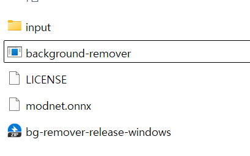

# Rust Background Remover

## 📌 프로젝트 개요
Rust 기반의 이미지 배경 제거 프로그램으로, ONNX Runtime을 사용하여 **MODNet** 모델을 실행합니다.  

## MODNet이란?
**MODNet** (Matting Objective Decomposition Network)은 **ZHKKKe** 팀에서 개발한 경량 딥러닝 네트워크로,  
이미지에서 **사람을 감지하고 배경을 제거** 할 수 있는 경량 네트워크입니다.  

🔗 [MODNet 공식 저장소 (GitHub)](https://github.com/ZHKKKe/MODNet)

본 프로젝트는 MODNet 공식 저장소에서 변환한 `MODNet.onnx` 모델을 사용하여 **이미지에서 배경을 제거**한 후 결과를 저장합니다.


## 🚀 사용 기술
- **Rust**
- **ONNX Runtime**
- **MODNet (ONNX 변환)**
- **Image Processing**


### 프로젝트 구조
```
background-remover/
├── modnet.onnx             # MODNet ONNX 모델 파일
├── input/                  # 원본 이미지 저장 폴더
├── output/                 # 배경 제거된 이미지 저장 폴더
├── src/
│   ├── main.rs             # 메인 실행 파일
│   ├── image_processor.rs  # 이미지 처리 모듈
│   ├── README.md           # 프로젝트 설명서
├── Cargo.toml              # Rust 프로젝트 설정 파일
```


## 🔧 설치 및 실행 방법


## 빠른 실행 

**release** : https://github.com/senspond20/rust-background-remover/releases/

**modnet.onnx** : https://drive.google.com/drive/folders/1WFq2nHFL7ZIvIp7O-CEXgDyeBLTKPhE-?usp=drive_link


### Windows

**release**에서 bg-remover-release-windows.zip 을 다운 받고 압축을 푸세요
background-remover.exe 파일이 있는 경로에 **modnet.onnx** 파일을 집어 넣으세요



input 디렉토리에 인물 이미지들을 넣으세요.
background-remover.exe 파일을 실행하세요.


작업이 완료되면 output 디렉토리를 확인하세요.


## Rust 프로젝트 빌드

```sh
git clone https://github.com/your-repo/rust-background-remover.git
cd rust-background-remover
cargo build --release
```

## 라이선스
- 본 프로젝트는 **MIT License**를 사용합니다.
- MODNet은 **Apache 2.0** 라이선스를 사용합니다.


